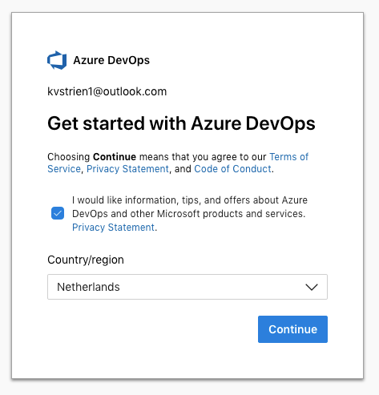
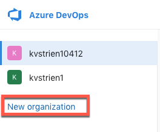
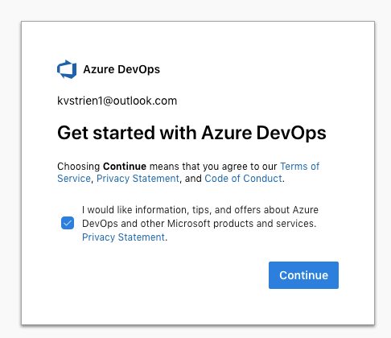
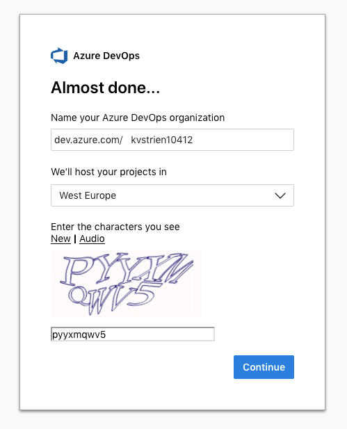
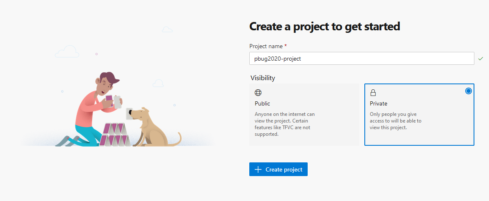

# Setup Guide Azure Devops voor Power BI

## Introductie

In deze **Setup Guide** staat stap-voor-stap hoe je je eerste Azure DevOps-omgeving kunt inrichten. **Wanneer je al een *organization* en *project* hebt binnen Azure DevOps kun je deze setup guide overslaan**.

## Stappenplan

Het stappenplan ziet er globaal als volgt uit:

1. Opzetten Azure DevOps organization
2. Inrichten Azure DevOps project

## Stappenplan in detail

Hieronder wordt in detail door de diverse stappen heen gelopen

### Opzetten Azure DevOps organization

* Ga naar [dev.azure.com](https://dev.azure.com/)
* Log in met een account dat gebruikt kan worden voor de training.
  * Wanneer dit toegestaan is, mag je een account vanuit je organisatie gebruiken.
  * Je kunt ook een bestaand Microsoft- of GitHub-account gebruiken, of hier een account voor aanmaken.

| Als trainingsaanbieder kun je hier inloggen met een account in het domein waar (tijdelijke) cursisten-accounts ook mogen bestaan.

Wanneer je voor het eerst inlogt op Azure DevOps, krijg het je het "get started with Azure DevOps" scherm:

Wanneer je eerder al van Azure DevOps gebruik gemaakt hebt, zul je dit scherm niet tegenkomen, maar kun je direct een nieuwe *Organization* aanmaken.

Maak nu een nieuwe *Organization* aan, door onderin het lijstje met bestaande *organizations* te kiezen voor **New Organization**.

Je krijgt nu het scherm **Get started with Azure DevOps**. Klik op **continue**.

Geef je *organization* een naam, en vul indien nodig de captcha correct in.

### Inrichten Azure DevOps project

Met de nieuwe *organization* geopend in de linkerzijde van het scherm, zie je aan de rechterzijde het volgende scherm:

Geef het project een naam, en klik op **Create project**
