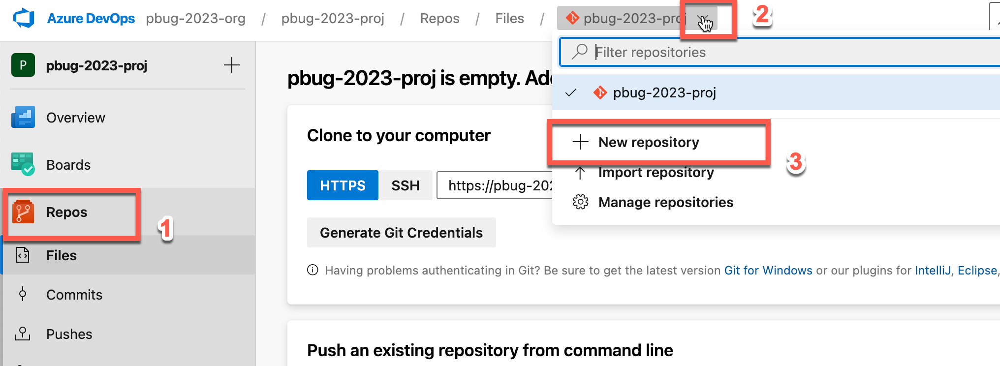
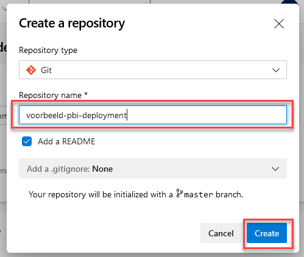

# Opzetten Git repository

## Achtergrond

Belangrijke Power BI-rapporten wil je het liefst borgen in versiebeheer. Dat maakt het makkelijker om wijzigingen weer ongedaan te maken. En dat maakt je weer vrijer om door te ontwikkelen zonder bang te zijn dat je zaken kwijtraakt.

In Azure DevOps wordt versiebeheer geregeld in **Azure DevOps Repos**. Binnen Azure DevOps Repos is **Git** de standaard manier van versiebeheer. Dit werkt naadloos samen met Azure DevOps Pipelines, waar we later de builds en releases zullen automatiseren.

We zullen vandaag niet al te diep ingaan op Git. Belangrijk om te beseffen is echter dat het in Git handig en gebruikelijk is om meerdere *repositories* aan te houden: eigenlijk elk stukje dat je los zou willen kunnen releasen geef je een eigen repository.

Voor sommige teams betekent dit dat je een repository maakt per rapport. Andere teams kiezen voor een repository per groep rapporten (bijvoorbeeld per klantengroep), of kiezen er zelfs voor om alle rapporten in één repository te zetten.

Binnen Azure DevOps is er geen limiet op het aantal Git-repositories.

## Aanmaken van een Git repository

Het aanmaken van je eerste Git-repository gebeurt automatisch door Azure DevOps. Wanneer je dus zojuist een *organization* en *project* hebt opgezet, zul je automatisch een Git-repository cadeau hebben gekregen met dezelfde naam als het project.

## Het aanmaken van een nieuwe Git-repository

We maken een Git-repository aan voor een rapport wat we in deze training zullen gebruiken om deployments mee door te voeren. Voer daarvoor de volgende stappen uit:

1. Kies in de linkerzijkant voor **Repos**
2. Klik **bovenin het scherm** op de **dropdown** naast de geselecteerde repository
3. Kies **New Repository**

4. Geef de repository een naam, bijvoorbeeld `voorbeeld-pbi-deployment`. Laat de overige instellingen ongewijzigd. Klik **Create**

