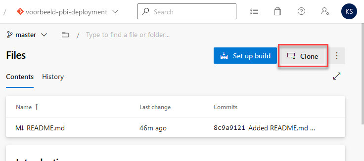
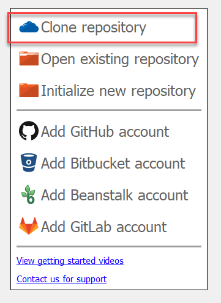
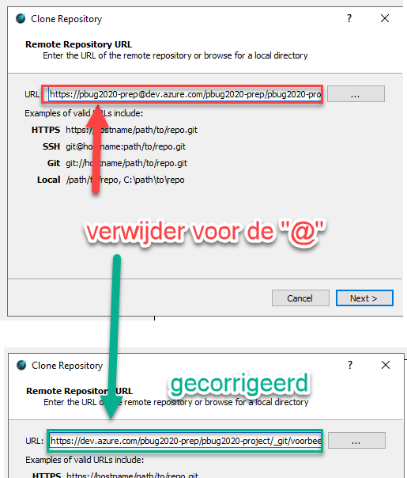
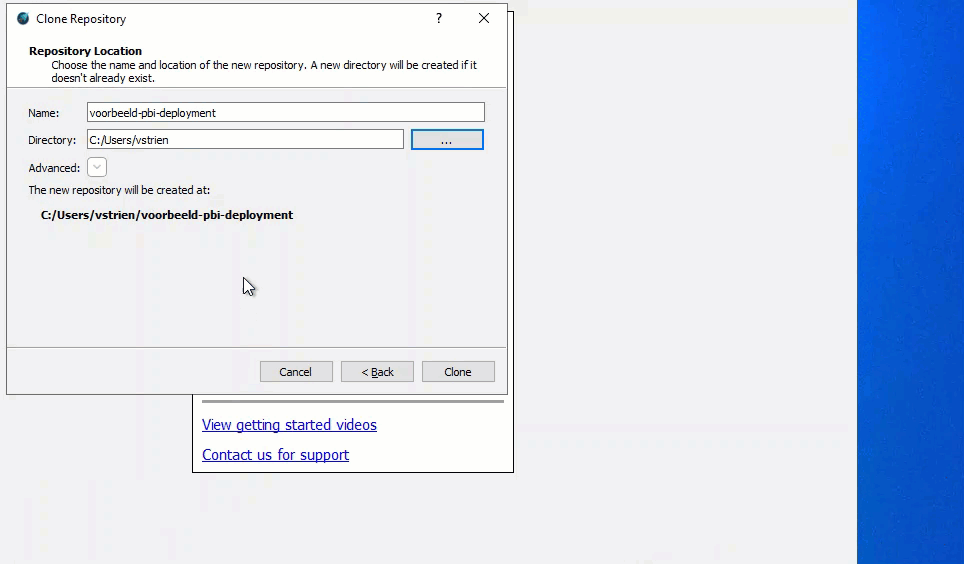
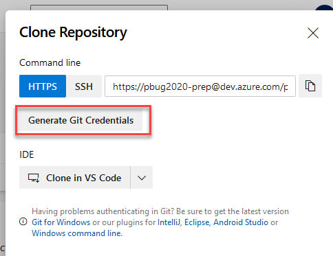
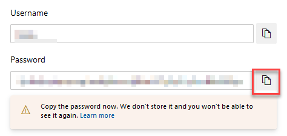
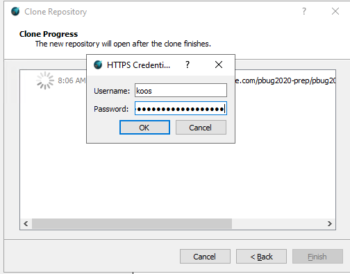

# Git lokaal gebruiken en installeren

## Installeren van Git tooling

Om Git lokaal te kunnen gebruiken in Windows, moeten we de Git executable installeren. Er zijn 1001 Git clients, en welke je gebruikt hangt sterk af van wat er in jouw organisatie ondersteund wordt, wat je gewend bent en hoe je Git wilt inzetten.

Omdat we vandaag niet zoveel op Git willen focussen, kiezen we voor een eenvoudige Git client: **GitAhead**.

Download en installeer GitAhead vanaf [https://gitahead.com/](https://gitahead.com/).

## Clone van repository

De map met spullen die "onder versiebeheer" staat, wordt in Git een *repository* genoemd. Om ermee aan de slag te gaan, maak je een *clone* van een repository. Je krijgt hiermee de volledige repository (inclusief geschiedenis) op jouw lokale omgeving.

Neem hiervoor de volgende stappen:

1. Open in Azure DevOps Repos de juiste repository (bijvoorbeeld `voorbeeld-pbi-deployment`)
2. Klik rechtsboven op **Clone**

3. Kopieer de URL. Laat het venster Clone Repository geopend!
4. Open GitAhead
5. Kies in het GitAhead scherm voor **Clone repository**

6. Plak de zojuist gekopieerde URL van Azure DevOps in het vakje "URL". Klik **Next**

7. Pas, indien gewenst, de directory aan naar een plek die voor jou logisch is (dit moet een lege directory zijn!).
   * Laat de naam ongewijzigd!
   * Je zou bijvoorbeeld de repository op het bureaublad kunnen zetten, zodat je er snel bij kan gedurende de cursus
   * Je kunt de map later ergens anders heen verplaatsen, alles wat je nodig hebt voor Git zit in die map
   * Klik op **Clone** wanneer je de juiste map geselecteerd hebt

**GitAhead vraagt nu om je credentials**. Deze gaan we aanmaken binnen Azure DevOps:

8. Kies, binnen het geopende Azure DevOps "clone" scherm, voor **Generate Git credentials**:

9. Kopieer de gebruikersnaam en het wachtwoord, en plak deze in het credentials-venster van GitAhead. Klik **OK**:

10. Het kan zijn dat GitAhead je nogmaals om de credentials vraagt - vul ze dan opnieuw in.

Je hebt nu een **clone** gemaakt van de Git repository. In deze map kun je een Power BI bestand gaan neerzetten dat je geautomatiseerd wilt releasen. Deze kunnen we vervolgens opnemen in versiebeheer.