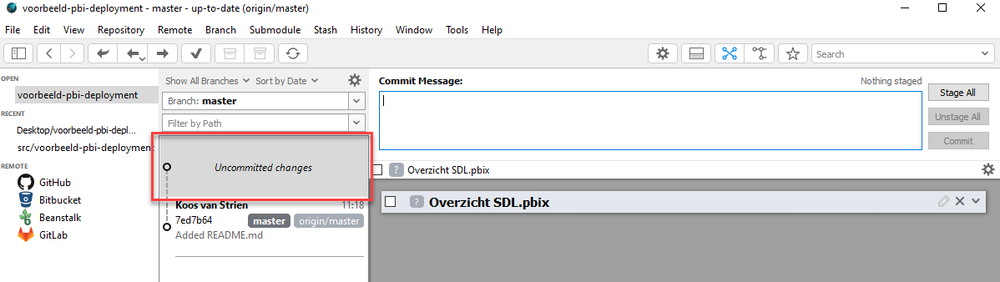
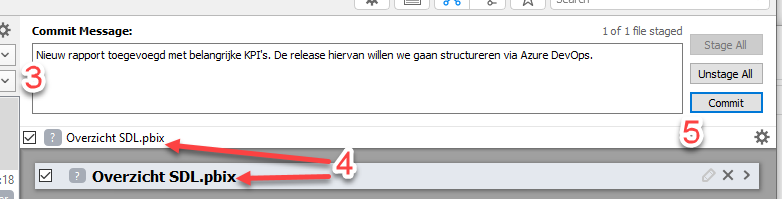
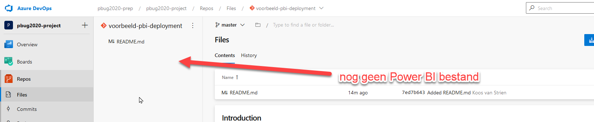
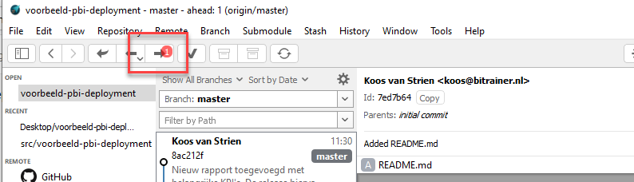
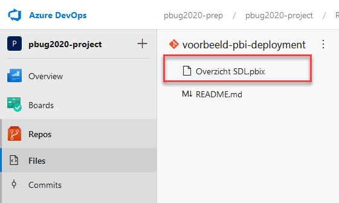
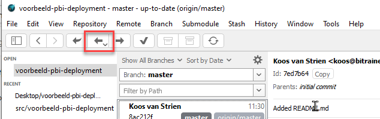

# Power BI in Git

Nu we een lokale *clone* gemaakt hebben van de Git repository, kunnen we deze gebruiken om bestanden in versiebeheer te brengen.
We zullen in de precon niet zo veel op Git ingaan, maar onthoud deze twee dingen:

1. Wanneer je een bestand in de map aanpast, is het niet automatisch versiebeheerd. Daarvoor moet je een **commit** doorvoeren.
2. Wanneer je een *commit* doorvoert, is je bestand alleen **lokaal** onder versiebeheer. Om het naar Azure DevOps te brengen doe je een **push**.

## Je eerste Power BI bestand in Git

1. Kopieer het bestand "demo-versiebeheer.pbix" naar de map waarin je eerder een *clone* van de repository hebt gemaakt
2. Open GitAhead

Zoals je ziet is er links van het midden een nieuw blokje "uncommitted changes" bij gekomen. Zoals hierboven genoemd moet je een *commit* doorvoeren om deze onder versiebeheer te brengen.

3. Geef een korte omschrijving van wat je gedaan hebt in het vakje "commit message"
4. Vink het zojuist toegevoegde rapport aan
5. Klik op **commit**

6. Het Power BI-bestand staat nu wel in versiebeheer, maar alleen nog lokaal op jouw computer. Open Azure DevOps, en verifieer dat je daar het Power BI bestand nog niet tegenkomt.

7. Klik nu binnen GitAhead op de "Push" button bovenin de toolbar. Deze heeft een rode bal om aan te geven dat er een commit klaar staat om gepusht te worden:

8. Je hebt nu de wijzigingen die je lokaal in versiebeheer hebt gezet ook gedeeld met de server. Open Azure DevOps, en verifieer dat het Power BI bestand daar nu wel zichtbaar is.

## Conclusie

Je hebt nu een basis werkwijze om met versiebeheer te werken:

* Wijzigingen maken in je werkdirectory (nieuwe bestanden, aangepaste bestanden)
* Commit doorvoeren met bijv. GitAhead
* Push "opsturen" naar de server

Wanneer je met collega's samenwerkt aan een rapport, is het ten slotte goed om te beseffen dat de wijzigingen in Azure DevOps ook niet automatisch op jouw computer terecht komen! Je kunt de meest recente wijzigingen van Azure DevOps ophalen via de knop **Pull** in GitAhead:

