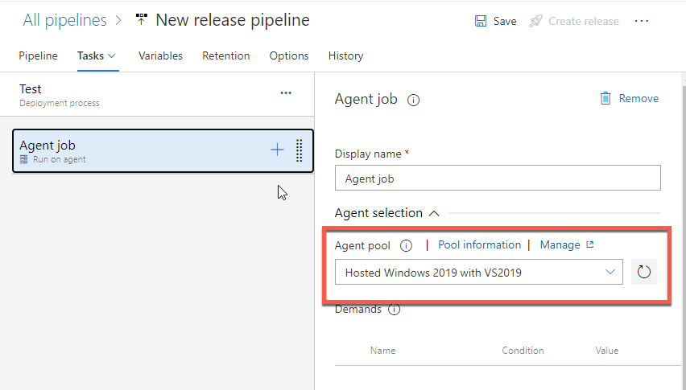

# Inrichten Azure DevOps Release pipeline

1. Ga naar Azure DevOps
2. Klik op **Pipelines**
3. Klik op **Releases**
4. Klik "New Pipeline"

> Wanneer je Azure DevOps-goeroes tegenkomt, zullen ze over het algemeen geen *release-pipelines* meer gebruiken. De reden hiervoor is dat Microsoft binnen Azure DevOps het onderscheid tussen "build" en "release" langzaamaan laat verdwijnen. In plaats daarvan komen "multi-stage pipelines".
>
> Voor ons doeleinde (het gestructureerd oplossen van je Power BI deployments met Azure DevOps), is dit echter de snelste manier om van start te gaan.

5. Klik **Empty job**

Azure DevOps vraagt je nu om de naam van je **Stage**. Een "stage" is voor ons het makkelijkst te vertalen als een "omgeving". Bijvoorbeeld een testomgeving.

6. Geef je eerste stage de naam "Test" en sluit de *pane*

Je ziet nu een scherm met twee onderdelen:

* Artifacts
* Stages

*Artifacts* zijn datgene wat je uitrolt over de omgevingen. Het idee van een "artifact" is dat het *onveranderbaar* is: als ik iets op een testomgeving heb goedgekeurd, wil ik dat *exact hetzelfde rapport* ook op mijn productie-omgeving komt.

Onder *Stages* zie je de zojuist aangemaakte stage *Test*. Daaronder staat de tekst `1 job, 0 tasks`.

Bovenin je scherm zie je een aantal tabjes binnen je release-pipeline. Hier vind je allerhande instellingen.

We voegen nu eerst een artifact toe. Dit is het startpunt: om een rapport ergens te kunnen plaatsen (deployment) moeten we het ergens vandaan halen. Daarom koppelen we allereerst de artifact:

7. Klik naast het kopje **Artifacts** op **Add**
8. Kies voor **Azure Repos Git** en vul de volgende instellingen in:
   * **Project**: kies via de dropdown het project waar je nu in werkt
   * **Source (repository)**: Kies uit de dropdown de repository waar je zojuist het eerste Power BI bestand in hebt neergezet.
   * **Default branch** (deze wordt zichtbaar zodra je de repository selecteert): Kies uit de dropdown `master`
   * Laat de overige instellingen op de standaardwaarden staan
   * Klik op **Add**

Je hebt nu een **Artifact** gekoppeld. Concreet betekent dit dat de verschillende *stages* in je deployment pipeline de nieuwste versie van ons ontwikkelde rapport meekrijgen. Een deployment op de testomgeving gaat dus gegarandeerd met hetzelfde rapport als een deployment op de productie-omgeving.

Nu we de *artifact* hebben ingericht, kunnen we een stappenplan opzetten voor een *stage*.

9. Klik op de tekst `1 job, 0 task`. Het tabblad **Tasks** opent zich.

Je komt nu in de taken die binnen jouw *stage* worden uitgevoerd. Azure DevOps verdeelt dit onder in **jobs** en **tasks**.
Een **job** is een verzameling taken die op een bepaald type computer moet worden uitgevoerd. Voor de uitrol van Power BI rapportages gebruik je gewoonlijk maar één job. Deze is standaard al voor je aangemaakt.

De **tasks** zijn datgene wat moet gebeuren om jouw *release* voor elkaar te krijgen.

8. Klik op **Agent job**. Je ziet aan de rechterzijde nu een eigenschappen-venster tevoorschijn komen. Als het goed is, staan de volgende instellingen hier:

* Agent Pool: Hosted Windows 2019 with VS2019

## Inrichten van de Stage

Om de uitrol van je Power BI rapport daadwerkelijk te automatiseren, moet er een stappenplan komen: de *tasks* list. Dit staat beschreven in [Inrichten Release Stage](06-inrichten-devops-release-stage.md).
