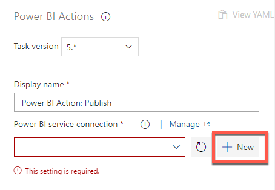
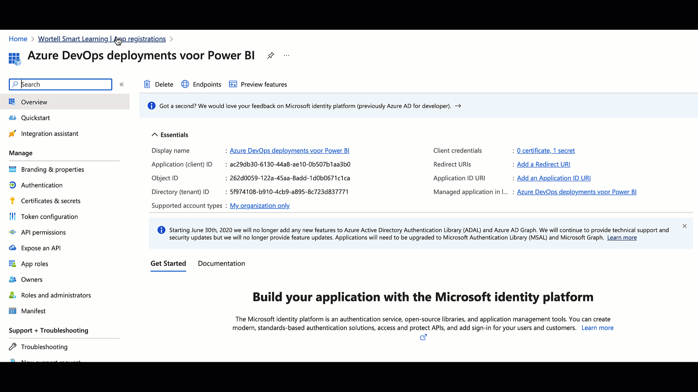

# Inrichten van de Stage

Om de uitrol van je Power BI rapport daadwerkelijk te automatiseren, moet er een stappenplan komen: de *tasks* list. We gaan hiervoor taken toevoegen.

## Voorbereiding

We hebben zojuist een [nieuwe release pipeline ingericht in Azure DevOps Pipelines](05-inrichten-azure-devops-release-pipeline.md). We hebben hier al een *artifact* aan gekoppeld, zodat de rapporten die we in versiebeheer zetten ook meekomen in een deployment. Nu zijn we de eerste *stage* aan het inrichten binnen de release pipeline.

## Taken toevoegen

9. Klik op het plusje naast de tekst **Agent Job**

10. Zoek naar **Power BI**

Er zijn nu twee mogelijke uitkomsten:

a. Er staat bovenaan een tekst **Marketplace**, met daaronder diverse mogelijke taken  
b. Er staan bovenaan één of meer taken, gevolgd door de tekst Marketplace

**Wanneer er boven *Marketplace* géén taken staan, moeten we eerst een taak toevoegen.** De taak wordt dan goedgekeurd voor je gehele *organization*, en kan daarna overal gebruikt worden.

### Toevoegen van de Power BI Actions taak aan je DevOps organization

Wanneer je voor het eerst een Power BI rapport wilt uitrollen via Azure DevOps, staan er nog geen Power BI-componenten in de takenlijst van Azure DevOps. Je moet nu éénmalig de taak **Power BI Actions** toevoegen aan je *organization* (daarna kun je de stappen 11-16 dus overslaan)

11. Klik op de taak **Power BI Actions** onder het kopje **Marketplace**
11. Kies **Get it free**

Er opent zich een nieuw tabblad, met de **Visual Studio Marketplace**

13. Klik op **Get it free**

14. Kies de DevOps organization waarbinnen je de Power BI bestanden en pipelines hebt neergezet.

15. Klik **Proceed to organization**

Power BI Actions is nu beschikbaar als taak binnen Azure DevOps pipelines. 

16. Schakel terug naar het browsertabblad waar je de DevOps pipeline aan het bewerken was, en klik **Refresh** naast **Add tasks**. 

17. Klik de zojuist toegevoegde **Power BI Actions** release task, en kies **Add**

18. Klik nu de zojuist toegevoegde **task** aan. Alle instellingen die erbij horen komen nu aan de rechterzijde.

Voordat we vanuit **Azure DevOps** een rapport kunnen releasen binnen **Power BI**, moeten we eerst een **service-connection** aanmaken. 
We gaan hier een **Service Principal** voor gebruiken.
Dit is iets wat je normaal gesproken maar één keer hoeft in te richten.

19. Kies onder **Authentication type** voor **Service Principal**
19. Klik onder **Power BI service connection** op **New**

> Er zijn twee mogelijkheden hier om te gebruiken: **User** en **Service Principal**.
> 
> Een **User** account is een *regulier* Power BI-account, waar géén Multi-Factor Authentication op geactiveerd is. Daarnaast moet je in het Power BI Developer-portaal een app registreren.
> Een **service principal** is een specifiek account voor automatisering binnen Azure. Deze zijn specifiek voor geautomatiseerde processen bedoeld. Daarom kiezen we nu voor een **service principal**.

### Inrichten van een service principal in de Azure Portal

Voordat Azure DevOps de eerste keer taken kan uitvoeren binnen Power BI, moet er eerst een account zijn waarmee Power BI dit kan doen. Deze inrichting doen we allereerst in de Azure Portal.

21. Open in een nieuw tabblad de [Azure portal](https://portal.azure.com)
21. Navigeer naar [Azure Active Directory](https://portal.azure.com/#blade/M1crosoft_AAD_IAM/ActiveDirectoryMenuBlade/Overview)
21. Ga naar **App registrations**
21. Klik op **New Registration**

25. Geef deze de naam **Azure DevOps deployments voor Power BI**. Laat de overige instellingen staan, en kies **Register**

We hebben nu een **registratie** binnen Azure AD gemaakt, maar deze heeft nog geen **rechten**. Ook is er nog geen manier om te **authenticeren**.

Rechten

26. Klik op **API permissions** om rechten toe te kennen.
26. Kies **Add a permission**
26. Kies voor **Power BI Service**

Azure AD vraagt nu wat voor soort *permissions* er nodig zijn.

29. Kies voor **Application permissions**
29. Selecteer alle permissies binnen **Power BI Service**. Kies **Add permissions**

31. **Belangrijk: Kies nu voor *Grant admin consent for (jouw organisatie)***. Dit zorgt ervoor dat de permissies die de applicatie *nodig heeft* ook daadwerkelijk *gegeven worden*.

32. Ga naar **Certificates & Secrets**
32. Klik **New client secret**
32. Geef deze nieuwe secret de naam **Azure DevOps voor Power BI secret**, en selecteer onder **Expires** de waarde **Never**

35. Kopieer de waarde van de secret die nu in je scherm komt, en plak deze tijdelijk op een plek waar je de secret later kunt terugvinden

Naast de *secret* die je zojuist gekopieerd hebt, hebben we nog twee andere gegevens nodig van de zojuist aangemaakte *service principal*.

36. Ga naar **overview**
37. Kopieer de volgende waarden naar een plek waar je ze straks eenvoudig terug kunt vinden:
    * **Application (client) ID**
    * **Directory (tenant) ID**

We hebben nu een service account aangemaakt. Vanuit Azure mag dit account weliswaar in Power BI enkele zaken uitvoeren, maar Power BI zelf staat nog niet toe dat service accounts de API gebruiken.

Security-wise is dat een goede keuze: we willen niet dat elk account met "toevallig" rechten op Power BI ook de API kan gebruiken. In plaats daarvan maken we een *security group* aan binne Azure AD. Binnen de Power BI admin zullen we vervolgens hier de benodigde rechten aan geven.

38. Navigeer terug naar de *Azure Active Directory* en kies voor **Groups**.
38. Kies **New Group**

40. Geef deze groep de naam **Azure DevOps Deployment Agent voor Power BI**
40. Voeg als **member** de zojuist aangemaakte **App** toe
40. Klik **Select**
40. Klik **Create** om de groep aan te maken

We hebben in de Azure Portal nu alle instellingen gedaan die nodig zijn voor de *service principal*. We gaan nu de drie gekopieerde waarden invullen in de nieuwe *Service Connection*

44. Open het tabblad waarin je de pipeline momenteel bewerkt. 

Als het goed is, staat het *pane* nog open waarin je de nieuwe **service connection** naar Power BI aan het leggen was. 

45. Vul de volgende gegevens in:
    * **Service Principal ID**: De eerder gekopieerde **Application (client) ID**
    * **Service Principal Key**: De eerder gekopieerde **Client secret**
    * **Tenant ID**: De eerder gekopieerde **Directory (tenant) ID**
    * **Service connection name**: Power BI voor Azure DevOps
    * Klik **Save**

46. Vul de naam van de *workspace* in waarnaar je in Power BI de deployment wilt uitvoeren
46. Gebruik de knop met ellipsis (`...`) om het Power BI rapport te selecteren in Azure Repos Git

48. Hernoem de pipeline naar *Voorbeeld deployment* en klik op **Save**

