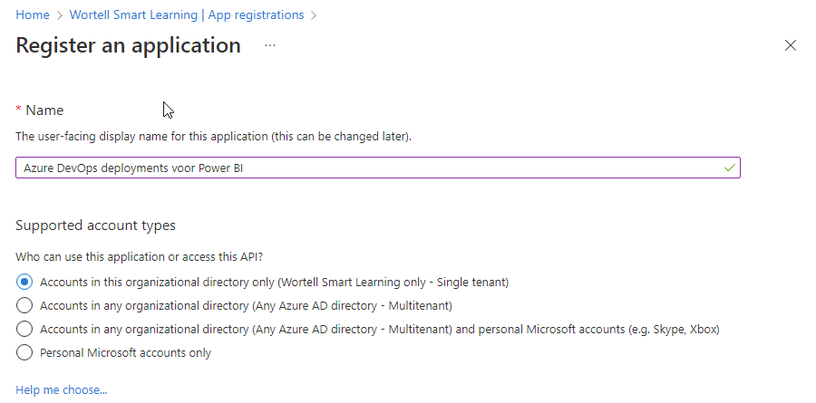
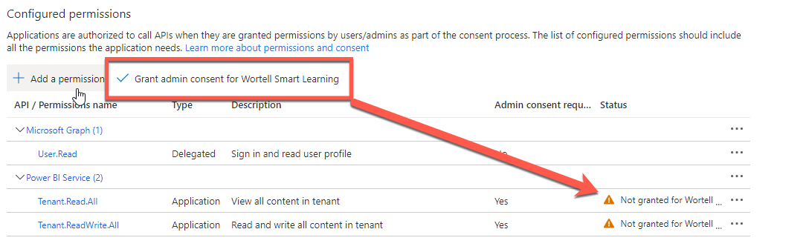
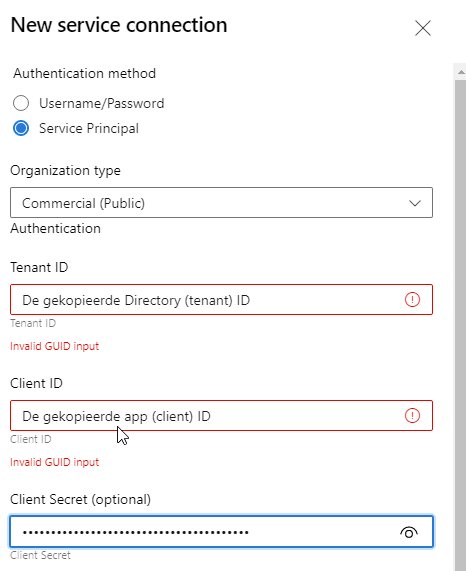
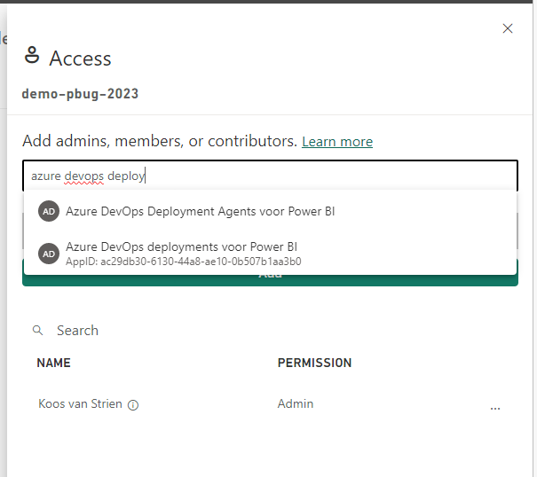

# Setting up the Stage

To actually automate the rollout of your Power BI report, there must be a step-by-step plan: the *tasks* list. We are going to add tasks for this.

## Preparation

We just provisioned a [new release pipeline in Azure DevOps Pipelines](05-provision-azure-devops-release-pipeline.md). We have already linked an *artifact* to this, so that the reports that we put in version management are also included in a deployment. Now we are setting up the first *stage* within the release pipeline.

## Add tasks

9. Click on the plus sign next to the text **Agent Job**

10. Search for **Power BI**

There are now two possible outcomes:

a. There is a text **Marketplace** at the top, with several possible tasks below it
b. There is one or more tasks at the top, followed by the text Marketplace

**If there are no tasks above *Marketplace*, we must first add a task.** The task will then be approved for your entire *organization*, and can then be used anywhere.

### Adding the Power BI Actions task to your DevOps organization

When you want to deploy a Power BI report via Azure DevOps for the first time, there are no Power BI components in the Azure DevOps task list yet. You now have to add the **Power BI Actions** task to your *organization* once (after that you can skip steps 11-16)

11. Click on the **Power BI Actions** task under the **Marketplace** heading
11. Choose **Get it free**

A new tab will open, showing the **Visual Studio Marketplace**

13. Click on **Get it free**

14. Choose the DevOps organization in which you have placed the Power BI files and pipelines.

15. Click **Proceed to organization**

Power BI Actions is now available as a task within Azure DevOps pipelines.

16. Switch back to the browser tab where you were editing the DevOps pipeline and click **Refresh** next to **Add tasks**.

17. Click the newly added **Power BI Actions** release task, and choose **Add**

18. Now click on the newly added **task**. All settings that belong to it are now on the right side.

Before we can release a report from **Azure DevOps** within **Power BI**, we must first create a **service connection**.
We are going to use a **Service Principal** for this.
This is something you normally only need to set up once.

19. Under **Power BI service connection**, click **New**

### Provision a service principal in the Azure portal

Before Azure DevOps can perform tasks within Power BI for the first time, there must first be an account with which Power BI can do this. We first do this configuration in the Azure Portal.

20. In a new tab, open the [Azure portal](https://portal.azure.com)
21. Navigate to [Azure Active Directory](https://portal.azure.com/#blade/M1crosoft_AAD_IAM/ActiveDirectoryMenuBlade/Overview)
21. Go to **App registrations**
21. Click on **New Registration**

24. Name it **Azure DevOps deployments for Power BI**. Leave the other settings, and choose **Registry**

We have now created a **registration** within Azure AD, but it does not have **entitlements** yet. Also, there is no way to **authenticate** yet.

Rights

26. Click on **API permissions** to grant permissions.
26. Choose **Add a permission**
26. Choose **Power BI Service**

Azure AD now asks what kind of *permissions* are needed.

29. Choose **Application permissions**
29. Select all permissions within **Power BI Service**. Choose **Add permissions**

31. **Important: Now choose *Grant admin consent for (your organization)***. This ensures that the permissions that the application *needs* are actually *given*.

32. Go to **Certificates & Secrets**
32. Click **New client secret**
32. Name this new secret **Azure DevOps for Power BI secret**, and under **Expires** select a value far in the future.

35. Copy the value of the secret that now appears on your screen, and paste it temporarily in a place where you can find the secret later

In addition to the *secret* you just copied, we need two other pieces of information from the *service principal* you just created.

36. Go to **overview**
37. Copy the following values to a place where you can easily find them later:
     * **Application (client) ID**
     * **Directory (Tenant) ID**

We have now created a service account. Although this account is allowed to do some things in Power BI from Azure, Power BI itself does not yet allow service accounts to use the API.

Security-wise, that's a good choice: we don't want every account with "accidental" rights to Power BI to be able to use the API. Instead, we create a *security group* within Azure AD. We will then give the necessary rights to this within the Power BI admin.

38. Navigate back to the *Azure Active Directory* and choose **Groups**.
38. Choose **New Group**

40. Name this group **Azure DevOps Deployment Agent for Power BI**
40. Add the **App** you just created as a **member**
40. Click **Select**
40. Click **Create** to create the group

We have now made all the settings required for the *service principal* in the Azure Portal. We are now going to fill in the three copied values in the new *Service Connection*

44. Open the tab where you are currently editing the pipeline.

If all goes well, the *pane* is still open in which you were creating the new **service connection** to Power BI.

45. Enter the following information:
     *Authentication method: **Service Principal**
     * Organization type: **Commercial (Public)**
     * **Tenant ID**: The previously copied **Directory (tenant) ID**
     * **Client ID**: The previously copied **Application (client) ID**
     * **Client Secret**: The previously copied **Client secret**
     * **Service connection name**: Power BI for Azure DevOps
     * Check the **Grant access permission to all pipelines** box
     * Click **Save**

> There are two ways to authenticate with Power BI: **User** and **Service Principal**.
>
> A **User** account is a *regular* Power BI account that does not have Multi-Factor Authentication activated. In addition, you must register an app in the Power BI Developer portal.
> A **service principal** is a specific account for automation within Azure. These are specifically intended for automated processes. That is why we now opt for a **service principal**.

46. At **Workspace Name** enter a new workspace that we will use for this deployment: `demo-pbug-2023`
46. Use the button with ellipsis (`...`) to select the Power BI report in Azure Repos Git
46. Check the following options:
     * **Overwrite Power BI File**
     * **Create if the workspace does not exist**
49. Rename the pipeline to *Example deployment* and click on **Save**

## Before you run the release

Before you release now, it's a good idea to manually create the newly named Power BI workspace (`demo-pbug-2023`).

If you do not do this, Power BI Actions will create the workspace for you, but you will not automatically have rights to it yet. Then you can't just get to it.

After creating the workspace you need to give the service principal administrator rights on this specific workspace. This ensures that deployments can take place on this.

