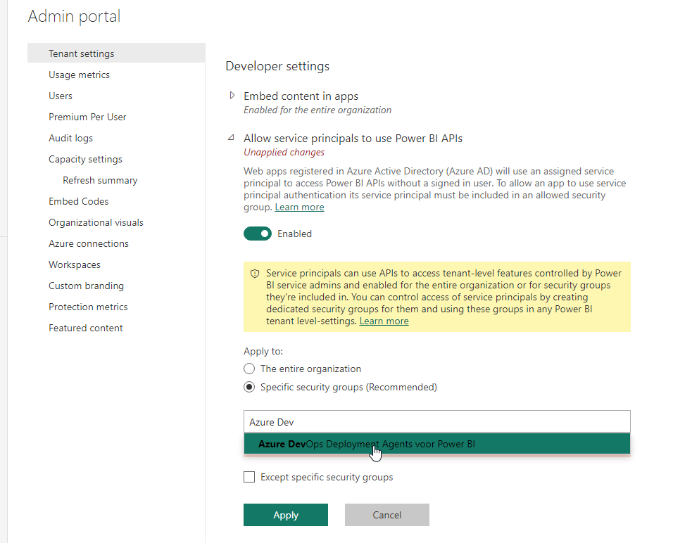

## Entitlement in Power BI

We now need to allow the Service Principal to perform administrative tasks in Power BI. To do this, follow these steps:

44. Go to the [Tenant Settings in Power BI Admin Portal](https://app.powerbi.com/admin-portal/tenantSettings)
44. Scroll to the heading **Developer settings** (near the bottom), and click **Allow service principals to use Power BI APIs** open.
44. Set this to **Enabled** and set it for **Specific security groups (recommended)**
44. Locate the newly created *Azure DevOps Deployment Agent for PowerBI* AD group
44. Choose **Apply**

