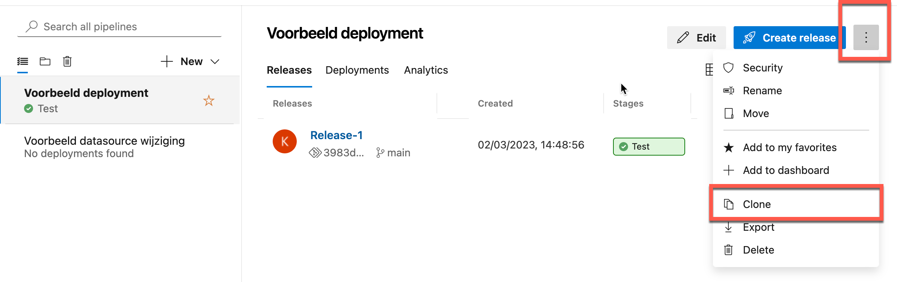

# Veranderen van datasources gedurende deployment

Het is mogelijk om via de Power BI API de datasource van een rapport te veranderen. We volgen daarvoor het volgende stappenplan:

* Publiceer het rapport
* Verander de datasource (bijvoorbeeld naar de test-database)
* Ververs de data

## Uitbreiden van de pipeline

1. Open **Azure DevOps**, navigeer naar **Pipelines**, **Releases**.
1. Maak een **clone** van de **Voorbeeld pipeline** die we eerder gemaakt hebben. 

De *clone* van de pipeline opent zich

3. Klik op de titel (*Voorbeeld pipeline - Copy*), en hernoem deze naar **Voorbeeld datasource wijziging**. 
3. Sla de pipeline op
3. Open de **tasks** voor de **Test** stage
3. Voeg opnieuw een **Power BI Action** taak aan toe, en geef deze de volgende instellingen mee:
   * Power BI Service connection: selecteer uit de dropdown **Power BI voor Azure DevOps**
   * Action: **Update DataSource connection**
   * Workspace Name: `demo-pbug-2023`
   * Vink **Update all datasources in workspace** aan
   * Dataset name: *laat leeg*
   * Datasource: **SQL**
   * Old server: **wortellsmartlearning.database.windows.net**
   * New server: **wortellsmartlearning-test.database.windows.net**
   * Old database: **courses**
   * New database: **courses-test**
3. Sla de pipeline op
3. Maak een nieuwe release aan.

We zijn er nu nog niet! Weliswaar is de data source aangepast, maar in ons specifieke geval zijn er ook andere credentials nodig. Ook hierbij kan Power BI Actions je helpen.

Kijk of je hier zelf uitkomt - de gegevens die je nodig hebt zijn als volgt:

* Username: `testuser`
* Password: `WortellSmartLearning.nl!`

Uiteraard weet je pas of de nieuwe credentials werken wanneer je de dataset ververst zonder dat dit fouten oplevert. Ook het verversen van de dataset kun je aansturen via Power BI Actions.

