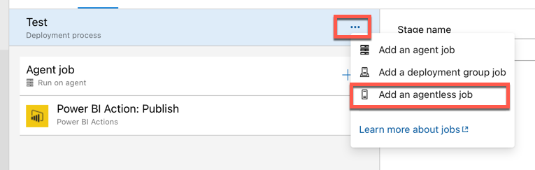
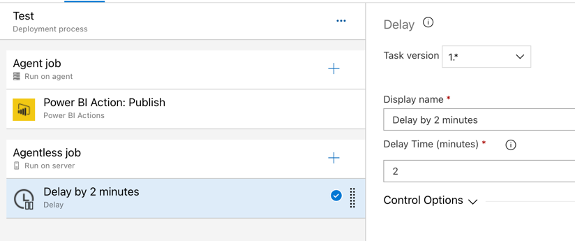

# Veranderen van datasources gedurende deployment

Het is mogelijk om via de Power BI API de datasource van een rapport te veranderen. We volgen daarvoor het volgende stappenplan:

* Publiceer het rapport
* Verander de datasource (bijvoorbeeld naar de test-database)
* Ververs de data

Er is één punt waar we echter goed op moeten letten:

* Wanneer je een bestaand rapport overschrijft en vervolgens direct de datasource wilt wijzigen, krijg je waarschijnlijk een foutmelding. De reden is dat er onder water een kenmerk is veranderd van het rapport, en het even duurt voor deze zichtbaar is in de API. De oplossing is **twee minuten wachten na publicatie van het rapport voordat je de datasource wijzigt**. Het goede nieuws: ook dat kan opgenomen worden in de pipeline.

Het volledige stappenplan komt daarmee op:

* Publiceer het rapport
* Wacht twee minuten
* Verander de datasource
* Ververs de data

## Uitbreiden van de pipeline

1. Open **Azure DevOps**, navigeer naar **Pipelines**, **Releases**.
1. Maak een **clone** van de **Voorbeeld pipeline** die we eerder gemaakt hebben. 

De *clone* van de pipeline opent zich

3. Klik op de titel (*Voorbeeld pipeline - Copy*), en hernoem deze naar **Voorbeeld datasource wijziging**. 
3. Sla de pipeline op
3. Open de **tasks** voor de **Test** stage

In de takenlijst voor de Test stage is één taak al toegevoegd: de publicatie van het rapport. Na de publicatie is het zaak om twee minuten te wachten, zodat de verschillende API's alle nieuwste data hebben over het zojuist gepubliceerde rapport.

Een wacht-actie kost in principe geen resources. We hoeven er dan ook geen *agent* aan toe te kennen met een specifiek *operating system*.

6. Klik op de ellipsis (...) naast **Test**, en kies **Add an agentless job**

7. Klik op het plus-teken bij de zojuist toegevoegde *agentless job*, en voeg een **Delay** taak toe. Stel deze in op 2 minuten.

8. Voeg een nieuwe **Agent job** toe die na de *Agentless job* uitvoert
8. Voeg hier opnieuw een **Power BI Action** taak aan toe, en geef deze de volgende instellingen mee:
   * Authentication type: Service Principal
   * Power BI Service connection: selecteer uit de dropdown **Power BI voor Azure DevOps**
   * Action: **Update DataSource connection**
   * Workspace Name: `demo-pbug-2020`
   * Vink **Update all datasources in workspace** aan
   * Dataset name: *laat leeg*
   * Datasource: **SQL**
   * Old server: **sigmadatalearning.database.windows.net**
   * New server: **sigmadatalearning-test.database.windows.net**
   * Old database: **sdl**
   * New database: **sdl-test**
8. Sla de pipeline op
8. Maak een nieuwe release aan.

## Conclusie - waar staan we?

We hebben nu een geautomatiseerde deployment van Power BI. Na de deployment wordt de datasource "omgehangen". Echter, Power BI kent (nog) geen *credentials* voor het rapport dat zojuist gepubliceerd is.

Er zijn diverse tools in de Azure DevOps Marketplace die een stukje van dit probleem oplossen, maar er is momenteel helaas niet één tool binnen de Visual Studio Marketplace waarin het mogelijk is om alles te doen wat we nodig hebben:

* Rapporten te publiceren
* Data sources te veranderen (nodig voor de DTAP/OTAP-straat)
* Credentials te veranderen

Vroeg of laat loop je hier tegenaan, en zul je - al dan niet in samenwerking met iemand die wat meer PowerShell en/of REST API-ervaring heeft - zelf een script moeten maken.

Dat is dan ook wat we als laatste stap gaan doen.