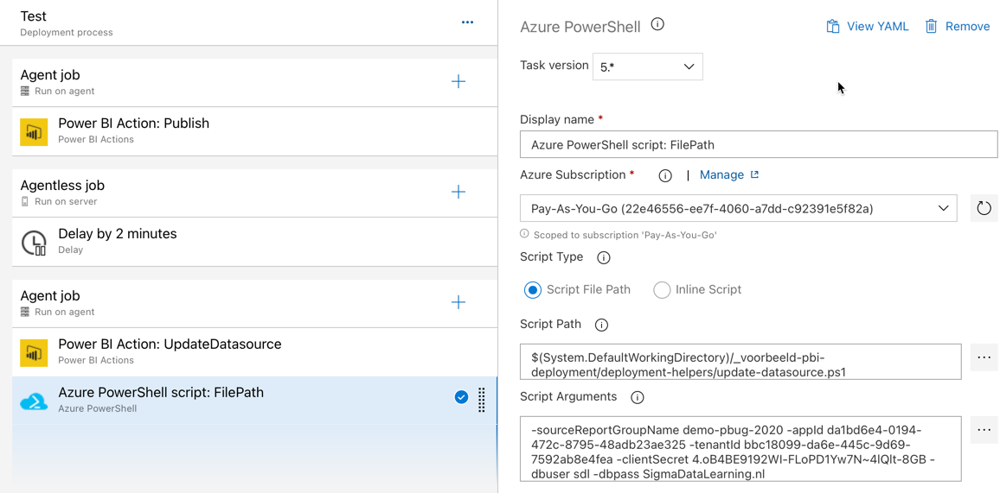

# PowerShell gebruiken om credentials te wijzigen

De extensies die momenteel beschikbaar zijn voor Azure DevOps en Power BI, werken goed. Ze kunnen echter niet altijd alles wat je graag zou willen. Gelukkig is de Power BI API ook eenvoudig aan te spreken via bijvoorbeeld PowerShell.

Als laatste "advanced" stap gaan we dan ook onze pipeline "afmaken" met een PowerShell-hulpscript. Dat script kun je [hier](helperscripts/update-datasource.ps1) vinden. 

## PowerShell script gebruiken

1. Download het helper-script van [helperscripts/update-datasource.ps1](helperscripts/update-datasource.ps1), en voeg het toe aan je versiebeheer. Plaats het in een nieuwe map `deployment-helpers` binnen de hoofdmap van je repository. 
1. Commit je wijzigingen, en push ze naar Azure DevOps
1. Open **Azure DevOps**, en navigeer naar **Pipelines**, **Releases**
1. Bewerk de pipeline **Voorbeeld datasource wijziging**, en schakel naar de **tasks** behorend bij de Test stage.
1. Voeg een **Azure PowerShell** toe onder de **Power BI Action: UpdateDatasource**
1. Zet de volgende instellingen voor deze nieuwe taak:
   * **Azure Subscription**: kies de Azure subscription waaronder je zojuist een AD account hebt aangemaakt
   * **Script Type**: Script File Path
   * **Script Path**: blader naar de zojuist geüploadede `update-datasource.ps1`
   * **Script Arguments**: Selecteer de ellipsis (...) en vul de volgende waarden in de tabel in:
     * **sourceReportGroupName** `demo-pbug-2020`
     * **appId** *app id van je service principal*
     * **tenantId** *tenant id van je service principal*
     * **clientSecret** *client secret van je service principal*
     * **dbuser** `sdl`
     * **dbpass** `SigmaDataLearning.nl`

7. Voeg nu een **Power BI Action** stap toe, waarin je de data laat verversen:
   * Authentication type: Service Principal
   * Power BI Service Connection: Power BI voor Azure DevOps
   * Action: Refresh a Dataset
   * Workspace Name: demo-pbug-2020
   * Dataset name: Overzicht SDL
7. Sla de pipeline op, en test deze door een nieuwe release te doen.
